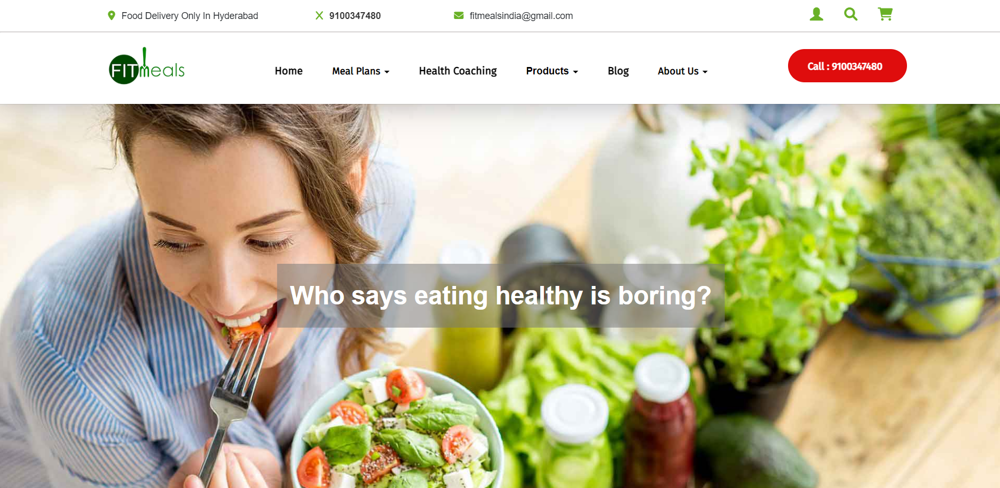

# FitMealsCLone
Unit 4 Project
__________________________
Project: Make a clone of www.fitmeals.co.in.

Cloned-Website: https://flourishing-brigadeiros-066ec5.netlify.app/

In this project we have tried to clone Fitmeal website, Styling using CSS and tried to make website more dynamic and responsive. With our efforts and the technology that we have learned in Unit-4 in the Masai School, we were able to clone the website in 6 days with the same looking and some features.

# Technology Stack Used 🌟
•	REACT
•	REDUX
•	HTML
•	CSS
•	JavaScript
•	BootStrap
   
For storing all data we used localStorage.
Snapshots 📷
•	 page (Home page)
 

•	Body care Page
  
•	Implement Sort By and Filters  Page
  

•	Cartage
  
•	Signup & Login Page

 

How to run the Project
•	Open my-app in your terminal.
•	Type 'npm install' for downloading dependencies.
•	Type 'npm start' in your terminal and you are good to go.

# End Notes 📑
In this project we have tried to  clone  the original website as much as possible. This entire journey of this Unit-4 construct week has given us 
experiences and we have learned lots of things about REACT, REDUX by applying to the real website and it gave us a lot more confidence in the REACT framework. Most of the features are added and functionality of the website are achieved.

# Limitations
Pages are not responsive yet and all the pages are not dynamic also, those pages might not be properly visible on small screen devices as we were given only 6 days to clone the website.

